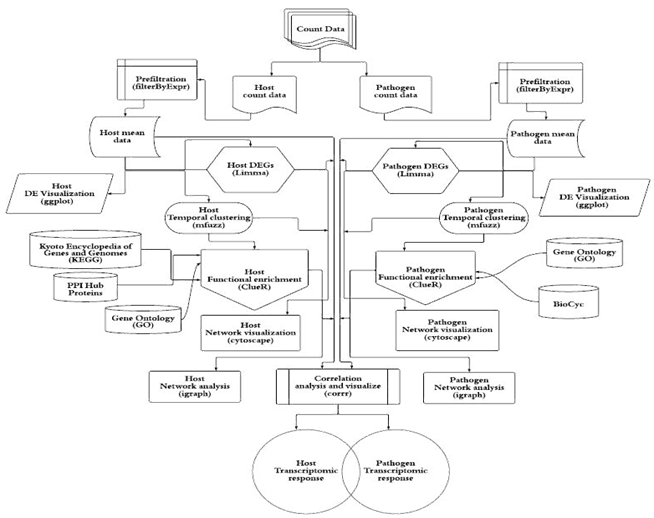

# dRNASb: A systems biology approach to decipher dynamics of host-pathogen interactions using temporal dual RNA-seq data
This repository contains the codes and usage documentation of the dRNASb (dual RNA-seq Systems biology-based analysis) pipeline, a systems biology-based computational pipeline to analyse temporal transcriptional clusters, incorporate molecular interaction networks (e.g., protein-protein interactions), identify topologically and functionally key transcripts in host and pathogen, and associate host and pathogen temporal transcriptome to decipher potential between-species interactions.  

## The Pipeline Schematic
Flowchart of the bioinformatic pipeline for the dual RNA-seq analysis of a host – pathogen interaction. The pipeline starts with data pre-processing and differential gene expression analysis following by Fuzzy clustering to decipher coherent patterns of temporal gene expression profiles. The pathway enrichment analysis was applied using KEGG and GO annotations to identify functions overrepresented by temporal clusters in host and pathogen (based on Fisher’s exact test with hypergeometric null hypothesis). To explore relationship and potential physical or regulatory interactions among differentially expressed genes, the protein-protein interaction (PPI) for both species and regulatory networks for pathogen were retrieved from different datasets. The topological characteristics of the genes were then identified. Additionally, the gene co-expression networks were constructed to infer cross-species gene associations and then used to identify hubs, betweenness centrality, closeness centrality and modularity followed by functional analysis.



## R package
The pipeline is made available as an R package.

To use this in your project :
```
devtools::install_github("VafaeeLab/dRNASb")
```
And within R :
```
library(dRNASb)
```

Two functions are made available, details can be obtained with :
```
?dRNASb_pipeline
?show_allowed_norm_methods
```
              
### Input Files
The pipeline accepts as input the following text files all in .csv format: 

- **Phenotype:** This file comprises two columns: 1) *Sample Name* corresponding to the column headers in the expression (read count) file, and 2) *Group* specifiying the time (or condition) of each sample. 
- **Read Counts**
- **Functional annotations**
- **PPIs**

[Data directory](Data) contains the input files used and other sample input files

[main.R](main.R) contains sample calls to the pipeline

## For More Information
Please refer to our paper in bioRxiv for details : https://doi.org/10.1101/2022.02.28.482417
