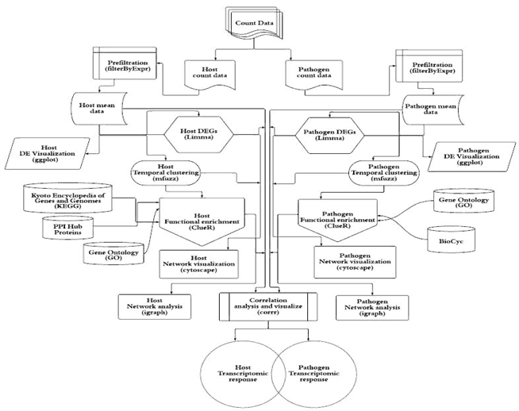

# dRNASb (dRNA-seq Systems biology-based analysis)

              
Latest modified code is in [dRNASb.R](R/dRNASb.R)

Please refer to our paper in bioRxiv for details : https://doi.org/10.1101/2022.02.28.482417
